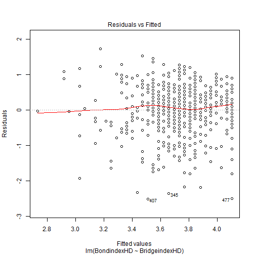

COMM 550-Lab Ten- Regression
=========================================================== 
#### [Back](http://joshaclark.com/?page_id=138)   

Regression is an extremely power family of statistics. Today we will only be looking at one
specific type, linear models (LM) aka Ordinary Least Squares (OLS) regression. Because 
regression is so powerful it is also important to do it right!
First let's load the libraries and install a new package, Zelig. Zelig will help us
interpret regression results later in this example
>install.packages('Zelig')


```r
library(Zelig)
library(ggplot2)
library(car)
```

Let's start by loading the EVE data which we used earlier this year.


```r
evedat<-read.csv(url('http://joshaclark.com/wp-content/uploads/2014/05/evedemodata.csv'))
```

This is from my COMM550 project
oh so long ago and is a sample of users who play the popular game EVE Online. Let's look at the relationship
between Bridging and Bonding Social Capital among the players. According to authors like Putnam social capital
forms a virtuous circle, so players who have more Bridging Capital (knowing a wide array of people) should also
have a lot of Bonding capital (feeling tight connections to people). We can specify a regression testing the relationship
between Bonding Capital (as the DV) and Bridging Capital as the IV. 


```r
OLS.1<-lm(BondindexHD~BridgeindexHD, data=evedat)
summary(OLS.1)
```

```
## 
## Call:
## lm(formula = BondindexHD ~ BridgeindexHD, data = evedat)
## 
## Residuals:
##     Min      1Q  Median      3Q     Max 
## -2.5221 -0.3997  0.0938  0.5293  1.8751 
## 
## Coefficients:
##               Estimate Std. Error t value             Pr(>|t|)    
## (Intercept)     2.3145     0.1876   12.34 < 0.0000000000000002 ***
## BridgeindexHD   0.3552     0.0468    7.58     0.00000000000014 ***
## ---
## Signif. codes:  0 '***' 0.001 '**' 0.01 '*' 0.05 '.' 0.1 ' ' 1
## 
## Residual standard error: 0.711 on 579 degrees of freedom
## Multiple R-squared:  0.0903,	Adjusted R-squared:  0.0887 
## F-statistic: 57.5 on 1 and 579 DF,  p-value: 0.000000000000137
```

R gives us a wide variety of outputs, including:
Descriptive statistics of the residuals (error) generated from the model
Coefficients, their STD Error, t-tests and P values
R2 (explained variance)
And omnibus ANOVA test to examine if the model as a whole is a good predictor.
We are most interested in the coefficients at this point. The intercept is the point
where the OLS line meets the y axis (so all predictors are pegged at zero). The coefficients
represent the increase in the DV per one unit increase of the IV holding any other variables constant. 
So a one unit increase in Bridging Capital leads to a 0.25426 increase in Bonding capital.
In other words we can calculate a predicted values of our DV using the classic linear slope formula
y=m*x+b where m is the coefficient, x is a given value of the dependent variable and b is the intercept,
so for Bridgeindex=3 we can say


```r
3*0.35518+2.31450
```

```
## [1] 3.38
```

We can plot what the fitted line looks like by adding a regression line to a scatter plot. 
NOTE: order is flipped for plotting, IV first, DV second.


```r
m<-qplot(BridgeindexHD,BondindexHD,  data=evedat)
m
```

 

```r
m+geom_smooth(method=lm, se=TRUE)
```

 

We can also wrap a confidence interval around a regression line (basically an estimate of where the "true"
line would run)


```r
m+geom_smooth(method=lm, se=TRUE)
```

 

If we run plot on the linear model we get a number of useful graphics.
-Residuals vs. fitted shows the relationship between the predicted values and their error (zero being perfect prediction)
-The QQ plot tells us if the residuals are normally distributed (just like ANOVA)
-Don't worry about scale vs. location right now
Residuals vs. leverage shows us the error versus how much a given measure changes the slope of the line, we are looking
for outliers which have really high residuals as well as high leverage as they have a big influence on our line.


```r
plot(OLS.1)
```

    

Variable 243 is way off the map, we can view the scores by typing


```r
evedat[243,]
```

```
##                    V1                   V2 V7        V8        V9 V10 Q23
## 243 R_5ALHmz2Lp7cHObW Default Response Set  0 3/31/2012 3/31/2012   1   1
##     Age Gender        Nation Educ GenTrust EVE EVEHD VidyaTime EVETime
## 243  36      1 united States    4        2  25    25        10       1
##     VOIP Text Face2 Coplayfr CoplayRom CoplayRel Starter RVB Faction
## 243    3    3     1        1         1         1       0   0       0
##     Trainjoin TrainTime TrainRec TrainStudent TrainTeacher TrainMentor
## 243         1         5        1            1            0           0
##     TrainAdmin CareerCount LongCorp Q18_2 Q20_1 ProtestGame ProtestBoard
## 243          0           3       51     5    15           0            0
##     ProtestNo ProtestOpp ProtestNoplay Bond1 Bond2 Bond3r Bond4 Bond5
## 243         1          0             0     5     5      4     5     5
##     Bond6 Bond7 Bond8 Bond9r Bond10 Bridge1 Bridge2 Bridge3 Bridge4
## 243     5     5     5      5      5       2       2       2       2
##     Bridge5 Bridge6 Bridge7 Bridge8 Bridge9 Bridge10 EndCon Bond3 Bond9
## 243       2       2       2       2       2        2      1     2     1
##     Bondindex Bridgeindex BondindexHD BridgeindexHD CurrentMem Alumni
## 243       4.9           2         4.9             2          1      0
##     NoTrain EveWeek TrainRatio
## 243       0     100       0.05
```

You can treat this variable like any outlier and leave it, replace it or ignore it, let's drop the case and rerun our model


```r
evedat.tr<-evedat[-243,]

OLS.1.tr<-lm(BondindexHD~BridgeindexHD, data=evedat.tr)
summary(OLS.1.tr)
```

```
## 
## Call:
## lm(formula = BondindexHD ~ BridgeindexHD, data = evedat.tr)
## 
## Residuals:
##     Min      1Q  Median      3Q     Max 
## -2.5098 -0.4041  0.0931  0.5195  1.7244 
## 
## Coefficients:
##               Estimate Std. Error t value             Pr(>|t|)    
## (Intercept)      2.247      0.188    11.9 < 0.0000000000000002 ***
## BridgeindexHD    0.371      0.047     7.9    0.000000000000014 ***
## ---
## Signif. codes:  0 '***' 0.001 '**' 0.01 '*' 0.05 '.' 0.1 ' ' 1
## 
## Residual standard error: 0.707 on 578 degrees of freedom
## Multiple R-squared:  0.0975,	Adjusted R-squared:  0.096 
## F-statistic: 62.5 on 1 and 578 DF,  p-value: 0.0000000000000138
```

```r
summary(OLS.1)
```

```
## 
## Call:
## lm(formula = BondindexHD ~ BridgeindexHD, data = evedat)
## 
## Residuals:
##     Min      1Q  Median      3Q     Max 
## -2.5221 -0.3997  0.0938  0.5293  1.8751 
## 
## Coefficients:
##               Estimate Std. Error t value             Pr(>|t|)    
## (Intercept)     2.3145     0.1876   12.34 < 0.0000000000000002 ***
## BridgeindexHD   0.3552     0.0468    7.58     0.00000000000014 ***
## ---
## Signif. codes:  0 '***' 0.001 '**' 0.01 '*' 0.05 '.' 0.1 ' ' 1
## 
## Residual standard error: 0.711 on 579 degrees of freedom
## Multiple R-squared:  0.0903,	Adjusted R-squared:  0.0887 
## F-statistic: 57.5 on 1 and 579 DF,  p-value: 0.000000000000137
```

```r
plot(OLS.1.tr)
```

    

So we have some change in the coefficents from dropping the outlier. 
We can also include nominal variables into a regression model through a process known as dummy coding. First we 
have to tell R to treat our variable as a nominal variable.


```r
table(evedat$Educ)
```

```
## 
##   1   2   3   4   5   6 
##  28  91 142  91 142  84
```

Oh dear, that's a lot of ones and twos, let's assign values to each and tell R to treat the variable as a factor.


```r
evedat$Educ.nom <- factor(evedat$Educ,
                          levels = c(1,2,3,4,5,6),
                          labels = c("No HS", "HS", "Some PS"
                                     , "Trade School", "PS degree"
                                     , "Post-Grad Deg"))

table(evedat$Educ.nom)
```

```
## 
##         No HS            HS       Some PS  Trade School     PS degree 
##            28            91           142            91           142 
## Post-Grad Deg 
##            84
```

Having turned the variable into a factor we can now include it in a regression model.
Regression allows us to estimate the effects of multiple independent variables on a predictor
essentially "controlling" for them. In other words the coefficients for multiple regression are 
expressions of the relationship between any given independent and dependent variable while taking
into account the influence of other predictors.
Let's estimate a multiple regression with Bridging Social Capital, Education and Age as independent
variables.


```r
OLS.2<-lm(BondindexHD~BridgeindexHD+Educ.nom+Age, data=evedat)
summary(OLS.2)
```

```
## 
## Call:
## lm(formula = BondindexHD ~ BridgeindexHD + Educ.nom + Age, data = evedat)
## 
## Residuals:
##    Min     1Q Median     3Q    Max 
## -2.459 -0.423  0.111  0.485  2.013 
## 
## Coefficients:
##                       Estimate Std. Error t value          Pr(>|t|)    
## (Intercept)            1.96167    0.24292    8.08 0.000000000000004 ***
## BridgeindexHD          0.35862    0.04704    7.62 0.000000000000104 ***
## Educ.nomHS             0.21998    0.15301    1.44            0.1511    
## Educ.nomSome PS        0.25054    0.14702    1.70            0.0889 .  
## Educ.nomTrade School   0.45156    0.15602    2.89            0.0039 ** 
## Educ.nomPS degree      0.36705    0.15034    2.44            0.0149 *  
## Educ.nomPost-Grad Deg  0.35552    0.16204    2.19            0.0286 *  
## Age                    0.00115    0.00362    0.32            0.7501    
## ---
## Signif. codes:  0 '***' 0.001 '**' 0.01 '*' 0.05 '.' 0.1 ' ' 1
## 
## Residual standard error: 0.707 on 570 degrees of freedom
##   (3 observations deleted due to missingness)
## Multiple R-squared:  0.112,	Adjusted R-squared:  0.101 
## F-statistic: 10.2 on 7 and 570 DF,  p-value: 0.00000000000408
```

If multiple predictors are strongly correlated with each other then this can inflate standard errors
through a process called multi-colinearity. We can test for it with VIF, variable inflation factor. VIF>2
is troublesome.


```r
vif(OLS.2)
```

```
##                GVIF Df GVIF^(1/(2*Df))
## BridgeindexHD 1.014  1           1.007
## Educ.nom      1.265  5           1.024
## Age           1.252  1           1.119
```

If you have a high VIF you may want to consider dropping or modifying the variable in question.
The results show that Bridging Capital is still a significant predictor as well as demonstrating that
higher levels of education have higher rates of social capital. Each of the categories broken out of
the dummy variables represents a shift in the intercept of the regression line in comparison to the first
category (no highschool). So the intercept for those with a Post-Secondary Degree is 0.36 points higher than 
those without,

If variables are on different scales then we can do a z-transformation, this alters each variable to have a mean
of zero and 1 represents a one standard deviation increase in values. This has the advantage of transforming all
your variables to be on the same scale (increases in standard deviation) but at the cost of some interpretability
Since the nominal variable only influences the intercept of the OLS line it doesn't make sense to standardize it.


```r
OLS.3<-lm(scale(BondindexHD)~scale(BridgeindexHD)+Educ.nom+scale(Age), data=evedat)
summary(OLS.3)
```

```
## 
## Call:
## lm(formula = scale(BondindexHD) ~ scale(BridgeindexHD) + Educ.nom + 
##     scale(Age), data = evedat)
## 
## Residuals:
##    Min     1Q Median     3Q    Max 
## -3.302 -0.568  0.149  0.651  2.704 
## 
## Coefficients:
##                       Estimate Std. Error t value        Pr(>|t|)    
## (Intercept)            -0.4132     0.1827   -2.26          0.0241 *  
## scale(BridgeindexHD)    0.3034     0.0398    7.62 0.0000000000001 ***
## Educ.nomHS              0.2955     0.2055    1.44          0.1511    
## Educ.nomSome PS         0.3365     0.1975    1.70          0.0889 .  
## Educ.nomTrade School    0.6065     0.2096    2.89          0.0039 ** 
## Educ.nomPS degree       0.4930     0.2019    2.44          0.0149 *  
## Educ.nomPost-Grad Deg   0.4775     0.2177    2.19          0.0286 *  
## scale(Age)              0.0141     0.0442    0.32          0.7501    
## ---
## Signif. codes:  0 '***' 0.001 '**' 0.01 '*' 0.05 '.' 0.1 ' ' 1
## 
## Residual standard error: 0.95 on 570 degrees of freedom
##   (3 observations deleted due to missingness)
## Multiple R-squared:  0.112,	Adjusted R-squared:  0.101 
## F-statistic: 10.2 on 7 and 570 DF,  p-value: 0.00000000000408
```

These results are read in the same way as OLS.2 but the coefficients represent a one standard deviation
increase instead of a one unit variance.      
Finally let's talk about generating predictions from your regression. With any given model you can plug in
chosen values from your data and then predict what that hypothetical person's score. Zelig is a package that
allows you to simulate predicted values by taking a bunch of sub-samples from your data and estimating a predicted
value. This gives you a prediction as well as a confidence interval
First we estimate the model just like OLS, the only changes being the Zelig call at the front of the line and the model term
where ls=least squares ie ordinary LEAST SQUARES.
Let's add another term just so we are aren't doing the same thing over and over again, this one is a nominal general trust
question asking "Can people be trusted?"


```r
evedat$GenTrust.nom <- factor(evedat$GenTrust,
                              levels = c(1,2,3),
                              labels = c("Yes","Sometimes","No"))

OLS.Z<-zelig(BondindexHD~BridgeindexHD+Educ.nom+Age+GenTrust.nom, data=evedat, model='ls')
```

```
## 
## 
##  How to cite this model in Zelig:
##   Kosuke Imai, Gary King, and Olivia Lau. 2014.
##   "ls: Least Squares Regression for Continuous Dependent Variables"
##   in Kosuke Imai, Gary King, and Olivia Lau, "Zelig: Everyone's Statistical Software,"
##   http://gking.harvard.edu/zelig
## 
```

Zelig delivers the same coefficients as the earlier model (OLS.2)


```r
summary(OLS.Z)
```

```
## 
## Call:
## lm(formula = formula, weights = weights, model = F, data = data)
## 
## Residuals:
##     Min      1Q  Median      3Q     Max 
## -2.3378 -0.4010  0.0953  0.5044  2.0750 
## 
## Coefficients:
##                        Estimate Std. Error t value             Pr(>|t|)
## (Intercept)            2.224182   0.252474    8.81 < 0.0000000000000002
## BridgeindexHD          0.338898   0.047174    7.18      0.0000000000022
## Educ.nomHS             0.218695   0.153609    1.42              0.15509
## Educ.nomSome PS        0.262129   0.147827    1.77              0.07674
## Educ.nomTrade School   0.438931   0.157126    2.79              0.00539
## Educ.nomPS degree      0.363635   0.151168    2.41              0.01648
## Educ.nomPost-Grad Deg  0.359702   0.162949    2.21              0.02769
## Age                   -0.000437   0.003693   -0.12              0.90586
## GenTrust.nomSometimes -0.235457   0.063618   -3.70              0.00024
## GenTrust.nomNo        -0.254420   0.101719   -2.50              0.01266
##                          
## (Intercept)           ***
## BridgeindexHD         ***
## Educ.nomHS               
## Educ.nomSome PS       .  
## Educ.nomTrade School  ** 
## Educ.nomPS degree     *  
## Educ.nomPost-Grad Deg *  
## Age                      
## GenTrust.nomSometimes ***
## GenTrust.nomNo        *  
## ---
## Signif. codes:  0 '***' 0.001 '**' 0.01 '*' 0.05 '.' 0.1 ' ' 1
## 
## Residual standard error: 0.7 on 557 degrees of freedom
##   (14 observations deleted due to missingness)
## Multiple R-squared:  0.137,	Adjusted R-squared:  0.123 
## F-statistic:  9.8 on 9 and 557 DF,  p-value: 0.0000000000000542
```

Now the cool part, we can set values for a hypothetical person and simulate what their values would be at any given score.
We can simulate a single point, such as someone who is 27 years old, everything else will be pegged at the mean or median
depending on the type of variable


```r
stx.1<-setx(OLS.Z, BridgeindexHD=3)
sim.1<-sim(OLS.Z, x=stx.1)
plot(sim.1)
```

 

```r
summary(sim.1)
```

```
## 
## Model:  ls 
## Number of simulations:  1000 
## 
## Values of X
##   (Intercept) BridgeindexHD Educ.nomHS Educ.nomSome PS
## 1           1             3          0               1
##   Educ.nomTrade School Educ.nomPS degree Educ.nomPost-Grad Deg  Age
## 1                    0                 0                     0 27.4
##   GenTrust.nomSometimes GenTrust.nomNo
## 1                     1              0
## attr(,"assign")
##  [1] 0 1 2 2 2 2 2 3 4 4
## attr(,"contrasts")
## attr(,"contrasts")$Educ.nom
## [1] "contr.treatment"
## 
## attr(,"contrasts")$GenTrust.nom
## [1] "contr.treatment"
## 
## 
## Expected Values: E(Y|X) 
##    mean   sd   50%  2.5% 97.5%
## 1 3.256 0.08 3.255 3.102 3.411
## 
## Predicted Values: Y|X 
##    mean   sd   50%  2.5% 97.5%
## 1 3.256 0.08 3.255 3.102 3.411
```

This gives us a range of values which were generated by the simulation which converge around 3.78.
We can also estimate a range of values to see how predicted values alter as an independent variable changes.
So we can predict the scores of people with Bridging Scores going from one to five and even compare between 
these two predictions


```r
stx.2<-setx(OLS.Z, BridgeindexHD=1:5, GenTrust.nom='No', Educ.nom='No HS')
stx.3<-setx(OLS.Z, BridgeindexHD=1:5, GenTrust.nom='Yes', Educ.nom='Post-Grad Deg')
sim.2<-sim(OLS.Z, x=stx.2, x1=stx.3)
plot(sim.2)
```

 

The two lines clearly diverge and we can see how the change in Bridging capital plays out at various points!
#### [Back](http://joshaclark.com/?page_id=138)
