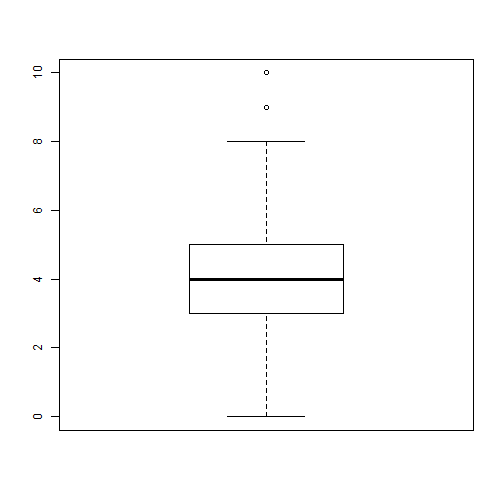

COMM 550-Lab Two: Welcome to R
===========================================================
#### [Back](http://joshaclark.com/?page_id=138)                                                  
Welcome to R! This lab will walk you through the basics of installing packages, loading data and
performing basic descriptive statistics on a dataset. For the purposes of this demo we'll be using
a dataset drawn from the TV show "Grey's Anatomy." This data is adapted from the [Bad Hessian](http://badhessian.org/2012/09/lessons-on-exponential-random-graph-modeling-from-greys-anatomy-hook-ups/) tutorial on ERGMs so all credit goes to them. 
Packages
-----------------------------------------
Packages are pieces of code which extend the functionality of R. They do everything from automating 
basic tasks to transforming R into an awesome tool for exotic forms of analysis. In order to take 
advantage of this power we need to learn to install packages using the simple syntax shown below.
To run one or two lines at a time select the code and hit ctrl (or command)-enter.

>install.packages('ggplot2')  
>install.packages('psych')

Install packages needed for this lab. Once done you can "comment out" these lines by placing
a "#'" sign in front of the line. This tells the computer not to read that script. If you don't
then R will re-download the package every time you run the entire script which is a pain. Notice
that the brackets have to be closed and the package name in quotes, if missing a bracket R will
prompt you in the console to complete the code, but missing quotes will break the code.


```r
istall.packages('ggplot2') 
```

```
## Error: could not find function "istall.packages"
```

```r
install.packages(ggplot2) 
```

```
## Error in install.packages : object 'ggplot2' not found
```

Mount the packages so R can use them. R won't load packages unless you tell it to in order to save memory.


```r
library(psych)
library(ggplot2)
```

Let's read our dataset into R. The data is in the common comma separated variable format which R is very good
at reading. As long as the file is in your working directory just use the read.csv command.


```r
dat<-read.csv(url('http://joshaclark.com/wp-content/uploads/2014/05/greydata.csv'))
```

Let's take a look at the data by looking at the variable names.


```r
names(dat)
```

```
## [1] "v01" "v02" "v03" "v04" "v05" "v06" "v07" "v08"
```

Oh they aren't labeled, we need to change that
The head command shows you the first few lines of a dataset, useful to see what's in it without
printing out thousands and thousands of rows


```r
head(dat)
```

```
##         v01 v02 v03  v04 v05 v06       v07 v08
## 1      lucy   1   0 1984   1   7    Cancer   5
## 2     adele   1   1 1949   0   2       Leo   5
## 3     avery   0   1 1981   3   6       Leo   5
## 4   addison   1   0 1967   1   1     Libra   5
## 5    torres   1   2 1975   1   2     Virgo   5
## 6 catherine   1   2 1950   1   8 Capricorn   5
```

To see the whole thing just type the name of the data frame


```r
dat
```

```
##             v01 v02 v03  v04 v05 v06         v07 v08
## 1          lucy   1   0 1984   1   7      Cancer   5
## 2         adele   1   1 1949   0   2         Leo   5
## 3         avery   0   1 1981   3   6         Leo   5
## 4       addison   1   0 1967   1   1       Libra   5
## 5        torres   1   2 1975   1   2       Virgo   5
## 6     catherine   1   2 1950   1   8   Capricorn   5
## 7          owen   0   0 1973   2   5         Leo   4
## 8    ellis grey   1   0 1957   1   1       Virgo   4
## 9       perkins   0   0 1965   6   7         Leo   4
## 10         reed   1   0 1981   3   6    Aquarius   4
## 11       olivia   1   0 1982   5   1   Capricorn   4
## 12        izzie   1   0 1978   3   1 Sagittarius   4
## 13        lloyd   0   1 1971   5   7   Capricorn   4
## 14 mrs. seabury   1   0 1952   0   3         Leo   4
## 15      preston   0   1 1963   1   1         Leo   4
## 16        derek   0   0 1966   1   1   Capricorn   4
## 17          ava   1   0 1975   0   3      Gemini   3
## 18        denny   0   0 1966   0   2      Taurus   3
## 19         hahn   1   0 1967   1   2      Gemini   3
## 20       kepner   1   0 1980   3   6       Libra   3
## 21         hank   0   0 1975   0   1 Sagittarius   3
## 22          ben   0   1 1972   6   6    Aquarius   3
## 23         lexi   1   0 1982   3   3       Aries   3
## 24       amelia   1   0 1981   1   7       Libra   3
## 25  thatch grey   0   0 1955   0   2         Leo   3
## 26       pierce   0   0 1986   4   4        <NA>   3
## 27   susan grey   1   0 1959   0   2      Taurus   3
## 28       altman   1   0 1969   1   6      Pisces   3
## 29         finn   0   0 1970   0   2      Cancer   3
## 30         yang   1   3 1971   3   1      Cancer   3
## 31        karev   0   0 1970   3   1      Cancer   3
## 32        steve   0   0 1984   0   2      Gemini   2
## 33       burton   0   0 1972   0   7      Cancer   2
## 34        colin   0   0 1944   1   3      Taurus   2
## 35         grey   1   0 1969   3   1     Scorpio   2
## 36      arizona   1   0 1976   1   5         Leo   2
## 37        megan   1   0 1979   4   4        <NA>   2
## 38     o'malley   0   0 1973   3   1       Aries   2
## 39       bailey   1   1 1969   1   1       Virgo   2
## 40        nancy   1   0 1965   0   3         Leo   2
## 41        sloan   0   0 1972   1   2     Scorpio   2
## 42       mostow   0   0 1985   4   4      Gemini   1
## 43       tucker   0   1 1970   0   2         Leo   1
## 44        chief   0   1 1954   2   1     Scorpio   1
```

Okay, time to name our variables something sensible. The c(") indicator marks a list of strings
which R will assign to variables in order. So name goes on the first col. gender on the second etc.


```r
names(dat) <- c("name","gender", "race", "byear", "position", "season", "sign", "rank")
names(dat)
```

```
## [1] "name"     "gender"   "race"     "byear"    "position" "season"  
## [7] "sign"     "rank"
```

```r
head(dat)
```

```
##        name gender race byear position season      sign rank
## 1      lucy      1    0  1984        1      7    Cancer    5
## 2     adele      1    1  1949        0      2       Leo    5
## 3     avery      0    1  1981        3      6       Leo    5
## 4   addison      1    0  1967        1      1     Libra    5
## 5    torres      1    2  1975        1      2     Virgo    5
## 6 catherine      1    2  1950        1      8 Capricorn    5
```

R will makes best guesses about the measurement levels of your variables but you may have to recode. In this case
we'll be treating position as a factor, or a nominal variable. So each job title is distinct and unordered.


```r
dat$position<-factor(dat$position, level=c(0:6), labels=c('non-staff','attending','chief', 'resident', 'intern', "nurse", 'other'))
```

We can do the same with gender and race, making it a factor and assigning a variable name


```r
dat$gender<-factor(dat$gender, labels=c('Male','Female'))
dat$race<-factor(dat$race, level=c(0:3), labels=c('White','Black',"Latino", "Asian"))
summary(dat$race)                
```

```
##  White  Black Latino  Asian 
##     33      8      2      1
```

R will do its best to identify factors beforehand, as an example it has already labelled sign as a factor because
it doesn't contain any numbers.                


```r
is.factor(dat$sign)                
```

```
## [1] TRUE
```

Now we want to make an ordered variable representing how many seasons a back a character was introduced
Unfortunately the only data that we have is what season they appeared, so right now Yang, played by (Sandra Oh)
would have a score of 1 because that is the season she joined the show, but we want her character to have a score
of 8 representing her duration as a member of the cast. Therefore we need to recode. Reverse coding is easy, just subtract
the old variable from a value+1 of its max value.


```r
maxseason<-max(dat$season)+1
maxseason
```

```
## [1] 9
```

```r
dat$intro=maxseason-dat$season
```

Finally let's look at the rank variable, this is a ranking of characters by fans from 1 (awful) to 5(awesome)
This makes it an ordinal variable but R is not treating it as such


```r
is.ordered(dat$rank)
```

```
## [1] FALSE
```

To convert it, use the following command


```r
dat$rank<-ordered(dat$rank)
```

Run is.ordered again to check to make sure it worked


```r
is.ordered(dat$rank)
```

```
## [1] TRUE
```

Good stuff! Let's take a look at what our dataset looks like now.


```r
head(dat)
```

```
##        name gender   race byear  position season      sign rank intro
## 1      lucy Female  White  1984 attending      7    Cancer    5     2
## 2     adele Female  Black  1949 non-staff      2       Leo    5     7
## 3     avery   Male  Black  1981  resident      6       Leo    5     3
## 4   addison Female  White  1967 attending      1     Libra    5     8
## 5    torres Female Latino  1975 attending      2     Virgo    5     7
## 6 catherine Female Latino  1950 attending      8 Capricorn    5     1
```

Descriptive stats are easy to do with the 'psych' package we installed and mounted earlier. All we do is run the following:


```r
descriptives<-describe(dat)
descriptives
```

```
##           vars  n    mean    sd median trimmed   mad  min  max range  skew
## name*        1 44   22.50 12.85   22.5   22.50 16.31    1   44    43  0.00
## gender*      2 44    1.52  0.51    2.0    1.53  0.00    1    2     1 -0.09
## race*        3 44    1.34  0.68    1.0    1.19  0.00    1    4     3  2.09
## byear        4 44 1970.09 10.43 1971.0 1970.83  8.90 1944 1986    42 -0.61
## position*    5 44    2.80  1.75    2.0    2.58  1.48    1    7     6  0.79
## season       6 44    3.25  2.26    2.0    3.06  1.48    1    8     7  0.63
## sign*        7 42    6.26  3.12    6.0    6.18  2.97    1   12    11  0.32
## rank*        8 44    3.14  1.13    3.0    3.14  1.48    1    5     4  0.02
## intro        9 44    5.75  2.26    7.0    5.94  1.48    1    8     7 -0.63
##           kurtosis   se
## name*        -1.28 1.94
## gender*      -2.04 0.08
## race*         4.13 0.10
## byear        -0.32 1.57
## position*    -0.42 0.26
## season       -1.13 0.34
## sign*        -0.91 0.48
## rank*        -0.83 0.17
## intro        -1.13 0.34
```

Easy, eh? We can also pass single variables or lists of variables to get more focused stats


```r
describe(dat$byear)
```

```
##   vars  n mean    sd median trimmed mad  min  max range  skew kurtosis
## 1    1 44 1970 10.43   1971    1971 8.9 1944 1986    42 -0.61    -0.32
##     se
## 1 1.57
```

Similarly frequency tables can be found with the table() function. Passing the entire dataset makes a mess so let's just look
at position                 


```r
table(dat$position)
```

```
## 
## non-staff attending     chief  resident    intern     nurse     other 
##        12        14         2         9         3         2         2
```

Running the same command over and over again is a pain, so the "apply" family of functions automates this
lapply looks over a list and runs the command "table" on each of the variables listed, giving us multiple
frequency tables at one. Try adding or removing variable names to see what happens.                 


```r
lapply(dat[c('gender', 'race', 'sign', 'position')],table)
```

```
## $gender
## 
##   Male Female 
##     21     23 
## 
## $race
## 
##  White  Black Latino  Asian 
##     33      8      2      1 
## 
## $sign
## 
##    Aquarius       Aries      Cancer   Capricorn      Gemini         Leo 
##           2           2           5           4           4          10 
##       Libra      Pisces Sagittarius     Scorpio      Taurus       Virgo 
##           3           1           2           3           3           3 
## 
## $position
## 
## non-staff attending     chief  resident    intern     nurse     other 
##        12        14         2         9         3         2         2
```

Let's say we are interested in the breakdown between character gender and position on the show. The first step
is to make a cross-tabulation. This shows genders as columns and position as rows with the frequency of people who
fit both descriptors as a value at the intersection of the two.                 


```r
genderjob<-table(dat$position, dat$gender)
genderjob
```

```
##            
##             Male Female
##   non-staff    7      5
##   attending    4     10
##   chief        2      0
##   resident     3      6
##   intern       2      1
##   nurse        1      1
##   other        2      0
```

We can transpose the table to make gender the rows and position the columns by flipping the order of the two in the
syntax.                 


```r
jobgender<-table(dat$gender,dat$position)                 
jobgender
```

```
##         
##          non-staff attending chief resident intern nurse other
##   Male           7         4     2        3      2     1     2
##   Female         5        10     0        6      1     1     0
```

To represent things as a clustered plot we can use the ggplot2 plackage. First we call the qplot function  (quick plot), provide the variable we want to examine (gender) as well as the dataframe (dat), then the "geom" or type of graph (in this case a histogram) and tell R to segement the graph by position so we can compare.            


```r
m<-qplot(gender, data=dat, geom='histogram', fill=position)
m
```

 

ggplot2 is vert versatile, if we simply wanted to see the distribution of fan rankings we can simplify the synax above and get:              


```r
n<-qplot(rank, data=dat, geom='histogram')                 
n
```

 

And done! Great work! R is extremely forgiving with regards to errors and messing things up. If things go wrong
you can always reload your dataset from the hard drive to roll back changes. Mess around with the help files by adding
?? before commands in the console or searching the help tab to the right. This demo should give you all the tools you need
to do the lab, or email me at joshuaac@usc.edu                
#### [Back](http://joshaclark.com/?page_id=138)
