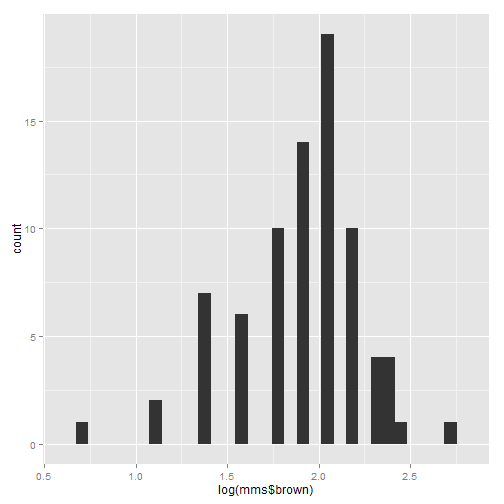

COMM 550-Lab Three: Data Management and Cleaning
===========================================================  
#### [Back](http://joshaclark.com/?page_id=138)
'Welcome to the Lab Three tutorial! In this guide we'll be covering how to clean
'and examine your dataset as well as compute new variables off of old ones. We'll
be using the following packages for this exercise, if you do not already have them installed
use the install.packages('') function to load them up.

>install.packages('car')  
>install.packages('VIM')


```r
library(car)
library(ggplot2)
library(VIM)
```

In this guide we'll be covering how to clean 
and examine your dataset as well as compute new variables off of old ones. 
We will be working with some values generated through random processes, so first we 
need to set a random number seed, this is the value which R takes as the starting
point for random number generation, if everyone has the same seed then we'll all
get the same random values.
Set the seed


```r
set.seed(11)
```

Generate one random value between 5 and 10


```r
runif(1, 5.0, 10)
```

```
## [1] 6.386
```

Cool, we all should have the same number! Okay, let's read our data from the working directory. 


```r
mms<-read.csv(url('http://joshaclark.com/wp-content/uploads/2014/05/mms.csv'))
```

And take a look at it.


```r
head(mms)
```

```
##   id brown red yellow blue green orange
## 1  1     8   2      7    2     2      2
## 2  2     4   4      5    4     2      4
## 3  3     6   3      5    1     4      3
## 4  4     7   2      9    1     2      2
## 5  5     8   0      7    3     3      4
## 6  6    10   3      4    1     1      2
```

The mms in this case represents my observations of what colors where in the packages
of M&M's I've eaten over the past few years. Each row represents one pack of candy
and each col. is the number of that color within the package. Now I like the red
yellow and orange candies the best, so let's create a new variable called goodcol which
is the total number of "good" candies in each package. To do that we write 
mms$NEWVARIABLENAME and assign some series of totals to it, in this case the sum
of all the good M&M's in the package. (Data drawn from [the Math Dept. of the University of Alabama-Huntsville](http://www.math.uah.edu/stat/data/MM.html))


```r
mms$goodcol<-mms$red+mms$yellow+mms$orange
summary(mms$goodcol)
```

```
##    Min. 1st Qu.  Median    Mean 3rd Qu.    Max.    NA's 
##       3      11      12      12      13      22      12
```

Now let's sum all of the bad colors. 


```r
mms$badcol<-mms$brown+mms$green+mms$blue
summary(mms$badcol)
```

```
##    Min. 1st Qu.  Median    Mean 3rd Qu.    Max.    NA's 
##     8.0    11.0    12.5    12.6    14.0    18.0       8
```

In order to statistically optimize my candy eating experience I want to see the percentage
of each package which I've eaten is made up of good colors and bad colors. Notice
that I can pass variables instead of numbers and R will automatically compute each
row.


```r
mms$pergood<-mms$goodcol/(mms$goodcol+mms$badcol)
```

We can calculate the % of bad candies in two ways, once again notice the mix of 
numbers and objects in the syntax.


```r
mms$perbad<-mms$badcol/(mms$goodcol+mms$badcol)
```

OR


```r
mms$perbad<-1-mms$pergood
```

We can also use R to transform variables. In this case we'll use various
transformations to coerce the variable "brown" into different distributions.


```r
qplot(mms$brown, geom="histogram")
```

```
## stat_bin: binwidth defaulted to range/30. Use 'binwidth = x' to adjust this.
```

 

```r
qplot(sqrt(mms$brown), geom="histogram")
```

```
## stat_bin: binwidth defaulted to range/30. Use 'binwidth = x' to adjust this.
```

 

```r
qplot(log(mms$brown), geom="histogram")
```

```
## stat_bin: binwidth defaulted to range/30. Use 'binwidth = x' to adjust this.
```

 

```r
qplot(exp(mms$brown), geom="histogram")
```

```
## stat_bin: binwidth defaulted to range/30. Use 'binwidth = x' to adjust this.
```

 

```r
qplot(mms$brown^2,geom="histogram")
```

```
## stat_bin: binwidth defaulted to range/30. Use 'binwidth = x' to adjust this.
```

 

```r
mms$brown.trans<-sqrt(mms$brown)
```

Let's try 'binning' the data, that is aggregating an interval variable into an
ordinal or nominal variables. Be CAREFUL when binning your data. It can be useful
but at the same time you are losing variance in your measurements. There is a lot 
less specificity in have five groups of people based on their age as opposed to 
simply entering how old they are. In this case we are going to group our count of
good candies into two bins, "lots" and "few" based on if they are above or below the
median of the data. First let's find the median using the summary function.


```r
summary(mms$goodcol)
```

```
##    Min. 1st Qu.  Median    Mean 3rd Qu.    Max.    NA's 
##       3      11      12      12      13      22      12
```

Then let's bin the data into our two groups using the cut function. First we'll 
create a new variable called "candybin" then use the function cut and provide the
variable we are cutting (in this case goodcol). Next we'll define breaks and use the 
c() functionality to provide a list of numbers which will serve as the points where
where R makes the cuts. So if we provide three numbers, x,y and z then R will create 
two bins, between x and y and between y and z. Finally we can provide labels just like
when we named our variables in the last section. The first label will go on the first bin
the second on the second bin etc etc.


```r
mms$candybin<-cut(mms$goodcol, breaks=c(0,11,18), labels=c('few', 'lots'))
head(mms)
```

```
##   id brown red yellow blue green orange goodcol badcol pergood perbad
## 1  1     8   2      7    2     2      2      11     12  0.4783 0.5217
## 2  2     4   4      5    4     2      4      13     10  0.5652 0.4348
## 3  3     6   3      5    1     4      3      11     11  0.5000 0.5000
## 4  4     7   2      9    1     2      2      13     10  0.5652 0.4348
## 5  5     8   0      7    3     3      4      11     14  0.4400 0.5600
## 6  6    10   3      4    1     1      2       9     12  0.4286 0.5714
##   brown.trans candybin
## 1       2.828      few
## 2       2.000     lots
## 3       2.449      few
## 4       2.646     lots
## 5       2.828      few
## 6       3.162      few
```

```r
summary(mms$candybin)
```

```
##  few lots NA's 
##   34   35   15
```

You will notice that we have a lot of NAs in the dataset. This is because I got
hungry at ate some of the candy before counting it. There are a few strategies for 
dealing with this problem. One is simply to delete the cases with missing data (listwise
deletion). This can be carried out using the na.omit function. Make a new object so you
don't overwrite your data.


```r
trimmms<-na.omit(mms)
head(trimmms)
```

```
##   id brown red yellow blue green orange goodcol badcol pergood perbad
## 1  1     8   2      7    2     2      2      11     12  0.4783 0.5217
## 2  2     4   4      5    4     2      4      13     10  0.5652 0.4348
## 3  3     6   3      5    1     4      3      11     11  0.5000 0.5000
## 4  4     7   2      9    1     2      2      13     10  0.5652 0.4348
## 5  5     8   0      7    3     3      4      11     14  0.4400 0.5600
## 6  6    10   3      4    1     1      2       9     12  0.4286 0.5714
##   brown.trans candybin
## 1       2.828      few
## 2       2.000     lots
## 3       2.449      few
## 4       2.646     lots
## 5       2.828      few
## 6       3.162      few
```

Oh dear, we lost a number of cases via deletion, which reduces our sample size
fortunately there are other options for dealing with missing data. As an example we can
use 'hot deck' imputation. This method looks through your dataset for cases with missing values
and then finds other cases which have similar values. From this "deck" of cases it will randomly
draw a value and replace the missing information with this score. This method will create
quite a few extra variables


```r
hotmms<-hotdeck(mms)
head(hotmms)
```

```
##   id brown red yellow blue green orange goodcol badcol pergood perbad
## 1  1     8   2      7    2     2      2      11     12  0.4783 0.5217
## 2  2     4   4      5    4     2      4      13     10  0.5652 0.4348
## 3  3     6   3      5    1     4      3      11     11  0.5000 0.5000
## 4  4     7   2      9    1     2      2      13     10  0.5652 0.4348
## 5  5     8   0      7    3     3      4      11     14  0.4400 0.5600
## 6  6    10   3      4    1     1      2       9     12  0.4286 0.5714
##   brown.trans candybin brown_imp red_imp yellow_imp blue_imp green_imp
## 1       2.828      few     FALSE   FALSE      FALSE    FALSE     FALSE
## 2       2.000     lots     FALSE   FALSE      FALSE    FALSE     FALSE
## 3       2.449      few     FALSE   FALSE      FALSE    FALSE     FALSE
## 4       2.646     lots     FALSE   FALSE      FALSE    FALSE     FALSE
## 5       2.828      few     FALSE   FALSE      FALSE    FALSE     FALSE
## 6       3.162      few     FALSE   FALSE      FALSE    FALSE     FALSE
##   orange_imp goodcol_imp badcol_imp pergood_imp perbad_imp brown.trans_imp
## 1      FALSE       FALSE      FALSE       FALSE      FALSE           FALSE
## 2      FALSE       FALSE      FALSE       FALSE      FALSE           FALSE
## 3      FALSE       FALSE      FALSE       FALSE      FALSE           FALSE
## 4      FALSE       FALSE      FALSE       FALSE      FALSE           FALSE
## 5      FALSE       FALSE      FALSE       FALSE      FALSE           FALSE
## 6      FALSE       FALSE      FALSE       FALSE      FALSE           FALSE
##   candybin_imp
## 1        FALSE
## 2        FALSE
## 3        FALSE
## 4        FALSE
## 5        FALSE
## 6        FALSE
```

Wow, what a mess, Hotdeck has created boolean variables (true/false) for each
case, telling us what data has been changed as well as new variables. Often we 
will not want to impute every bit of data so we can perform the same operation on 
a single variable instead. Let's look at what hotdeck creates when it only has
to deal with one variable


```r
hotstuff<-hotdeck(mms$red)
head(hotstuff)
```

```
##   data data_imp
## 1    2    FALSE
## 2    4    FALSE
## 3    3    FALSE
## 4    2    FALSE
## 5    0    FALSE
## 6    3    FALSE
```

We have to columns created by the process, if we only want to add the values
to our dataset we can do so by just placing a $data after the command just like
any other column.


```r
mms$red.hot<-hotdeck(mms$red)$data
summary(mms$red)
```

```
##    Min. 1st Qu.  Median    Mean 3rd Qu.    Max.    NA's 
##     0.0     3.0     4.0     3.9     5.0    10.0       2
```

Finally let's look for outliers among our data. We can do this with a box and whisker plot.
The middle black line is the median (4) while the solid box around it shows the first 
and third quartile. The whiskers (thin lines leading out) show the maximum and minimum
without outliers. Outliers are those values which are 1.5 times the inter-quartile range
(the difference between the third and first quartile) away from first quartile (for lower
then expected scores) or third (for higher than expected scores). Let's do the math first
then our box plots. 
We can get all the information about quartiles by looking at the summary(mms$red.hot)
command we just passed. So the inter-quartile range is:


```r
5-3
```

```
## [1] 2
```

Which we can multiply by 1.5 to get


```r
ol<-(5-3)*1.5
```

So upper outliers are anything beyond


```r
5+ol
```

```
## [1] 8
```

And lower


```r
3-ol
```

```
## [1] 0
```

Since we can't have less than zero candies we only have to worry about higher outliers
(i.e. those greater then 8)
Let's take a look at our boxplot


```r
boxplot(mms$red.hot)
```

 

Two upper outliers we can extract them by placing the $out command behind the boxplot function


```r
outliers<-boxplot(mms$red.hot)$out
```

 

```r
outliers
```

```
## [1]  9 10
```

We have two outliers, 9 and 10, both >8. There are a variety of ways to deal with them
1-Replace with the nearest non-outlier value (8). We use if-else logic for this. The 
first statement says if the value is greater than 8, replace with 8, otherwise keep it
with the original value.


```r
mms$red.hot.clean <- ifelse(mms$red.hot>8, 8, mms$red.hot) 
summary(mms$red.hot.clean)
```

```
##    Min. 1st Qu.  Median    Mean 3rd Qu.    Max. 
##    0.00    3.00    4.00    3.85    5.00    8.00
```

```r
table(mms$red.hot)
```

```
## 
##  0  1  2  3  4  5  6  7  8  9 10 
##  3  9  8 18 18 12  7  2  5  1  1
```

```r
table(mms$red.hot.clean)
```

```
## 
##  0  1  2  3  4  5  6  7  8 
##  3  9  8 18 18 12  7  2  7
```

The other option is to simply cut the outliers out of the dataset to make a new body of data
We start with


```r
nrow(mms)
```

```
## [1] 84
```

cases, then:


```r
trimmms<- mms[which(mms$red.hot<8.375),]
table(trimmms$red.hot)
```

```
## 
##  0  1  2  3  4  5  6  7  8 
##  3  9  8 18 18 12  7  2  5
```

Which leaves us with less data to work with.


```r
nrow(trimmms)
```

```
## [1] 82
```

Either route, make sure you explain and justify your choices in your methodology section.
This week's lab is going to use the height and weight data again, you will need to bin
and transform data, as well as deal with outliers and and missing data. Once again
all the code you will need is within this tutorial, but you will need to change it
to work in a new setting. You should also practice writing your own code and developing
your own style. Some people always write variable names in CAPs or lowercase. You can
use periods or underscores to represent spaces and much more. Experiment and find
a style that works for you.
Good luck!

#### [Back](http://joshaclark.com/?page_id=138)
