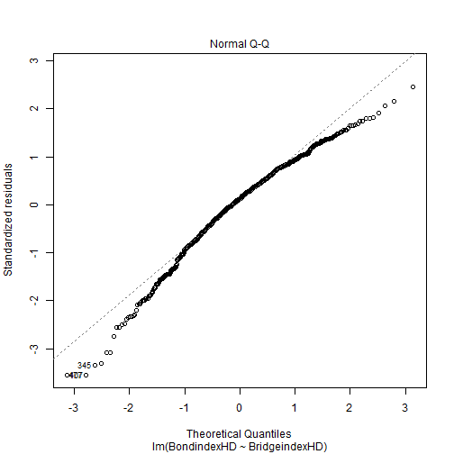
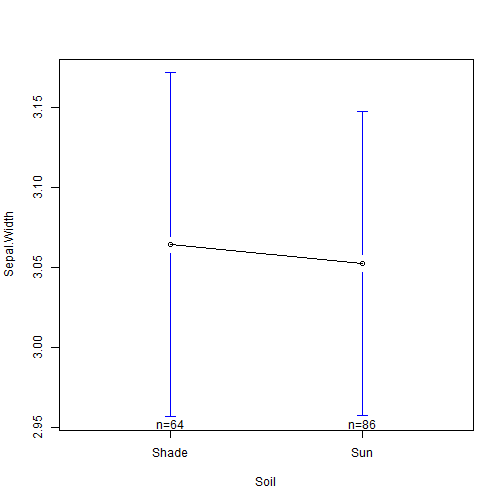

COMM 550-Lab Seven- ANOVA II
=========================================================== 
#### [Back](http://joshaclark.com/?page_id=138)
Let's begin by installing two packages we need for this example
heplots gives us access to a nice eta^2 function which we will
discuss in a few minutes, while gplots allows us to graph the
changes in the means across various conditions. 
>install.packages('heplots')   
>install.packages('gplots')   


```r
library(car)
library(heplots)
library(gplots)
library(ggplot2)
```

For a complete change of pace from last week, we'll be looking at 
a dataset about pretty flowers! The iris dataset contains a 150 observations
of the size of flowers from three species of iris growing in two different soil conditions, this is a modification of an existing dataset in R with some added variables.


```r
iris<-read.csv(url('http://joshaclark.com/wp-content/uploads/2014/06/irisdemo.csv'))
head(iris)
```

```
##   Sepal.Width Species  Soil
## 1         2.3  setosa   Sun
## 2         2.9  setosa   Sun
## 3         3.0  setosa Shade
## 4         3.0  setosa   Sun
## 5         3.0  setosa Shade
## 6         3.0  setosa Shade
```

We can see that the flowers are evenly divided among species with roughly even growing 
conditions


```r
table(iris$Soil)
```

```
## 
## Shade   Sun 
##    64    86
```

```r
table(iris$Species)
```

```
## 
##     setosa versicolor  virginica 
##         50         50         50
```

```r
qplot(Sepal.Width, data=iris, fill=Soil)
```

```
## stat_bin: binwidth defaulted to range/30. Use 'binwidth = x' to adjust this.
```

```
## Warning: position_stack requires constant width: output may be incorrect
```

 

We're interested in seeing if a particular species produces bigger sepals (the outermost part 
of a flower) then the other species, and what soil conditions promote the best growth. 
As always let's start by testing for the equality of variance, we can load multiple categories
into the Levene's Test with the comma. 


```r
leveneTest(iris$Sepal.Width, iris$Species:iris$Soil)
```

```
## Levene's Test for Homogeneity of Variance (center = median)
##        Df F value Pr(>F)
## group   5    0.94   0.46
##       144
```

Now onto some one way ANOVAs! This should be review from last week, but let's see
if a specific species does better than the others in the garden.


```r
a.1<-aov(iris$Sepal.Width~iris$Species)
```

Eta squared is another way to conceptualize the size of a statistical effect. It is basically
the proportion of variance explained by your model, with a perfect model explaining 100% of the 
variance in the dependent variable.


```r
etasq(a.1)
```

```
##              Partial eta^2
## iris$Species        0.4008
## Residuals               NA
```

```r
summary(a.1)
```

```
##               Df Sum Sq Mean Sq F value              Pr(>F)    
## iris$Species   2   11.3    5.67    49.2 <0.0000000000000002 ***
## Residuals    147   17.0    0.12                                
## ---
## Signif. codes:  0 '***' 0.001 '**' 0.01 '*' 0.05 '.' 0.1 ' ' 1
```

Clearly one species is doing better. But which one? The omnibus ANOVA which we just ran
does not differentiate between more than two groups, the omnibus test call tell us that there
are differences between species but not which species does better or worse. 
One way to tell is to plot the means of the various groups and wrap a 95% CI around each value. 
This will show us which group is higher or lower and the relative confidence of each estimate.


```r
plotmeans(iris$Sepal.Width~iris$Species)
```

 

Another option is to do a pairwise t test to compare between the various groups. Once you 
start comparing between more than two groups the chances increase that there will be a 
difference due to random chance alone. As an example, if we compared our flowers based 
on species, soil, light, rainfall, number of surrounding plants, pesticide use etc etc
the odds increase that there will be one combination which may lead to a difference even
if only by random noise. To counter act that we use a number of p value adjustments
which take into account this problem and try to adjust the criteria for significance 
in response. The oldest and most conservative (i.e. most likely to give you a false negative
but least likely to give you a false positive) is the Bonferroni correction, which is also
the name of band which I played bass in during high school.


```r
??pairwise.t.test
a1.t<-pairwise.t.test(iris$Sepal.Width, iris$Species, p.adj = "bonf")
a1.t
```

```
## 
## 	Pairwise comparisons using t tests with pooled SD 
## 
## data:  iris$Sepal.Width and iris$Species 
## 
##            setosa               versicolor
## versicolor < 0.0000000000000002 -         
## virginica  0.0000000014         0.0094    
## 
## P value adjustment method: bonferroni
```

We can see that even with the correction there is a significant difference based on species.
We've been working various diagnostics processes into the class without my explicitly mentioning it, but
it is time to bring in another test to make sure our data fits the assumptions of ANOVA, namely the normality
of the residuals. Residuals are basically the difference between the observed result from the data and the 
estimation of any given statistical model. ANOVA demands that the residuals be normally distributed for a 
number of reasons which Hayes talks about at greater length. We can test the normality of the residuals with
a histogram or a qqplot. With the histogram we are just looking for a roughly normal distribution. The qqplot
compares the distribution of the residuals against the sample, if they are the same (i.e. the plot is a roughly
straight line) then our residuals are normally distributed.


```r
qqnorm(residuals(a.1))
```

 

```r
qplot(residuals(a.1))
```

```
## stat_bin: binwidth defaulted to range/30. Use 'binwidth = x' to adjust this.
```

 

Let's do the entire process again only looking at soil conditions. Because there are only two possible 
groups (sunny and shady) we don't need a t-test with adjustments.


```r
a.2<-aov(Sepal.Width~Soil, dat=iris) #'alternative way of writing a function
summary(a.2)
```

```
##              Df Sum Sq Mean Sq F value Pr(>F)
## Soil          1   0.01  0.0051    0.03   0.87
## Residuals   148  28.30  0.1912
```

```r
qqnorm(residuals(a.2))
```

 

```r
plotmeans(Sepal.Width~Soil, dat=iris) #'alternative way of writing, does the same thing
```

 

```r
etasq(a.2)
```

```
##           Partial eta^2
## Soil          0.0001786
## Residuals            NA
```

Now the fun part! What about if the species is interacting with the soil type. As an example some species 
may grow bigger in shade or sun. Interaction can take all kinds of forms, but can basically be represented as the
effect which occurs when both of the interacting variables are present. To use a silly example, if we are testing
sweetness of the first sip of coffee with two binary variables sugar (y/n) and stirring (y/n) then we have the following 
research design


. | Yes Sugar | No Sugar
---|-----------|---------
**Yes Stir** | Sweet | Not Sweet
**No Stir** | Not Sweet | Not Sweet


Sweetness is not a function or sugar or stirring but interaction of the two, similarly with our flowers it might
not be simply the species or the conditions but a mix of the two. We can express this within an ANOVA by 
multiplying the two variables together and calculating the results. Note, you need the components of the interaction
in the equation, so if you don't include them R will add them in automatically.


```r
a.3<-aov(Sepal.Width~Soil+ Species + Soil*Species, dat=iris)
summary(a.3)
```

```
##               Df Sum Sq Mean Sq F value              Pr(>F)    
## Soil           1   0.01    0.01    0.05               0.832    
## Species        2  11.40    5.70   51.09 <0.0000000000000002 ***
## Soil:Species   2   0.84    0.42    3.77               0.025 *  
## Residuals    144  16.06    0.11                                
## ---
## Signif. codes:  0 '***' 0.001 '**' 0.01 '*' 0.05 '.' 0.1 ' ' 1
```

```r
qqnorm(residuals(a.3))
```

 

```r
etasq(a.3)
```

```
##              Partial eta^2
## Soil               0.00364
## Species            0.41508
## Soil:Species       0.04973
## Residuals               NA
```

We can look at the differences between and among groups with an interaction plot, specifically we are 
looking for instances where lines cross or intersect in some way


```r
interaction.plot(iris$Species, iris$Soil, iris$Sepal.Width, type='b', col=c("red", "dark green", "blue"),
                 xlab="Partner Status", ylab=" Mean Sepal.Width Score")
```

 

There appears to be some form of interaction surrounding growing conditions and virginica, we can
examine this more closely with the "Tukey Honest Significant Differences" test, basically a cousin
to the adjusted paired t-test that we did earlier. This will give us the difference between all the groups
and possible conditions as well as p-values, we can also pick out subsets which we are interested in. We 
are looking for significant results where both the soil type and the species change, so we go from sun to shade
and from one species to another


```r
TukeyHSD(a.3)
```

```
##   Tukey multiple comparisons of means
##     95% family-wise confidence level
## 
## Fit: aov(formula = Sepal.Width ~ Soil + Species + Soil * Species, data = iris)
## 
## $Soil
##               diff     lwr     upr  p adj
## Sun-Shade -0.01174 -0.1207 0.09724 0.8317
## 
## $Species
##                         diff      lwr     upr  p adj
## versicolor-setosa    -0.6566 -0.81478 -0.4984 0.0000
## virginica-setosa     -0.4535 -0.61172 -0.2953 0.0000
## virginica-versicolor  0.2031  0.04487  0.3613 0.0079
## 
## $`Soil:Species`
##                                      diff       lwr      upr  p adj
## Sun:setosa-Shade:setosa           0.02981 -0.243272  0.30289 0.9996
## Shade:versicolor-Shade:setosa    -0.79583 -1.096634 -0.49503 0.0000
## Sun:versicolor-Shade:setosa      -0.55625 -0.816751 -0.29575 0.0000
## Shade:virginica-Shade:setosa     -0.36250 -0.647247 -0.07775 0.0044
## Sun:virginica-Shade:setosa       -0.49821 -0.766572 -0.22986 0.0000
## Shade:versicolor-Sun:setosa      -0.82564 -1.121442 -0.52984 0.0000
## Sun:versicolor-Sun:setosa        -0.58606 -0.840769 -0.33135 0.0000
## Shade:virginica-Sun:setosa       -0.39231 -0.671767 -0.11285 0.0011
## Sun:virginica-Sun:setosa         -0.52802 -0.790763 -0.26528 0.0000
## Sun:versicolor-Shade:versicolor   0.23958 -0.044647  0.52381 0.1514
## Shade:virginica-Shade:versicolor  0.43333  0.126728  0.73994 0.0010
## Sun:virginica-Shade:versicolor    0.29762  0.006172  0.58907 0.0423
## Shade:virginica-Sun:versicolor    0.19375 -0.073432  0.46093 0.2960
## Sun:virginica-Sun:versicolor      0.05804 -0.191607  0.30768 0.9848
## Sun:virginica-Shade:virginica    -0.13571 -0.410562  0.13913 0.7110
```

```r
TukeyHSD(a.3, "Soil")
```

```
##   Tukey multiple comparisons of means
##     95% family-wise confidence level
## 
## Fit: aov(formula = Sepal.Width ~ Soil + Species + Soil * Species, data = iris)
## 
## $Soil
##               diff     lwr     upr  p adj
## Sun-Shade -0.01174 -0.1207 0.09724 0.8317
```

```r
TukeyHSD(a.3, "Species")
```

```
##   Tukey multiple comparisons of means
##     95% family-wise confidence level
## 
## Fit: aov(formula = Sepal.Width ~ Soil + Species + Soil * Species, data = iris)
## 
## $Species
##                         diff      lwr     upr  p adj
## versicolor-setosa    -0.6566 -0.81478 -0.4984 0.0000
## virginica-setosa     -0.4535 -0.61172 -0.2953 0.0000
## virginica-versicolor  0.2031  0.04487  0.3613 0.0079
```

```r
TukeyHSD(a.3, "Soil:Species")
```

```
##   Tukey multiple comparisons of means
##     95% family-wise confidence level
## 
## Fit: aov(formula = Sepal.Width ~ Soil + Species + Soil * Species, data = iris)
## 
## $`Soil:Species`
##                                      diff       lwr      upr  p adj
## Sun:setosa-Shade:setosa           0.02981 -0.243272  0.30289 0.9996
## Shade:versicolor-Shade:setosa    -0.79583 -1.096634 -0.49503 0.0000
## Sun:versicolor-Shade:setosa      -0.55625 -0.816751 -0.29575 0.0000
## Shade:virginica-Shade:setosa     -0.36250 -0.647247 -0.07775 0.0044
## Sun:virginica-Shade:setosa       -0.49821 -0.766572 -0.22986 0.0000
## Shade:versicolor-Sun:setosa      -0.82564 -1.121442 -0.52984 0.0000
## Sun:versicolor-Sun:setosa        -0.58606 -0.840769 -0.33135 0.0000
## Shade:virginica-Sun:setosa       -0.39231 -0.671767 -0.11285 0.0011
## Sun:virginica-Sun:setosa         -0.52802 -0.790763 -0.26528 0.0000
## Sun:versicolor-Shade:versicolor   0.23958 -0.044647  0.52381 0.1514
## Shade:virginica-Shade:versicolor  0.43333  0.126728  0.73994 0.0010
## Sun:virginica-Shade:versicolor    0.29762  0.006172  0.58907 0.0423
## Shade:virginica-Sun:versicolor    0.19375 -0.073432  0.46093 0.2960
## Sun:virginica-Sun:versicolor      0.05804 -0.191607  0.30768 0.9848
## Sun:virginica-Shade:virginica    -0.13571 -0.410562  0.13913 0.7110
```

Be VERY careful when interpreting "main effects" such as the influence of soil or species alone if there is
a significant interaction term because the influence of these terms will shift according to the other independent
variables in the equation.
#### [Back](http://joshaclark.com/?page_id=138)
