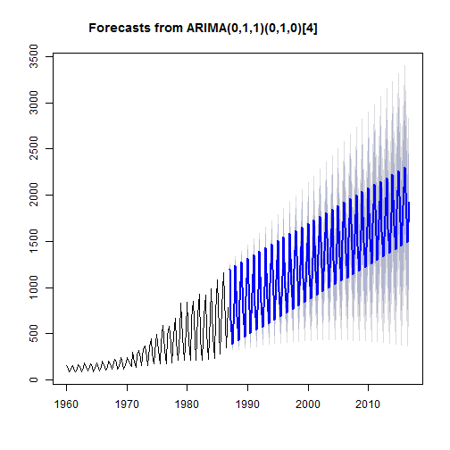
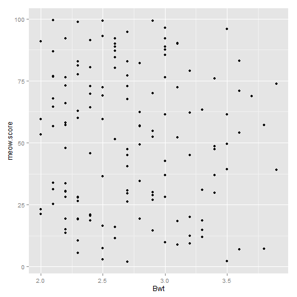
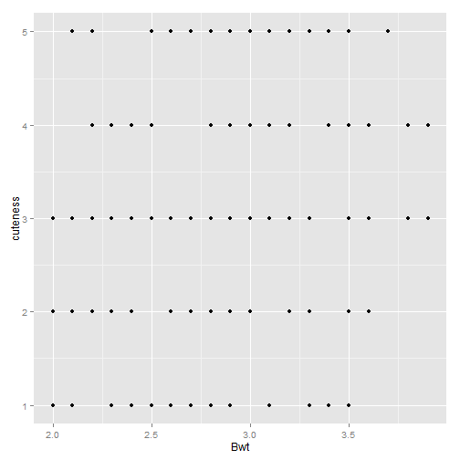

COMM 550-Lab Eight and Nine- Chi^2 and Correlation
=========================================================== 
#### [Back](http://joshaclark.com/?page_id=138)
Today we'll be looking at both the Chi^2 test and some forms of correlation and reliability analysis (if we have time)! Let's start by installing two packages we'll need for this demo.
 >install.packages('ppcor')   
 >install.packages('MASS')  


```r
library(MASS)
library(psych)
library(ppcor)
library(ggplot2)
```

First up is a Chi Square test. This test looks at the observed distribution of cases between
two groups and compares it to a theoretical distribution if the two groups were totally independent.
This is useful in determining if a factor or categorical variable is influencing a dependent variable
you are interested in. 
Let's look at some data built into R, a survey of 237 statistics students at the University of Adelaide. This data is built into R so we can just call it with the data() command. 
We'll be using some randomly generated data so let's set the random number seed to start.


```r
set.seed(11)

data(survey)
head(survey)
```

```
##      Sex Wr.Hnd NW.Hnd W.Hnd    Fold Pulse    Clap Exer Smoke Height
## 1 Female   18.5   18.0 Right  R on L    92    Left Some Never  173.0
## 2   Male   19.5   20.5  Left  R on L   104    Left None Regul  177.8
## 3   Male   18.0   13.3 Right  L on R    87 Neither None Occas     NA
## 4   Male   18.8   18.9 Right  R on L    NA Neither None Never  160.0
## 5   Male   20.0   20.0 Right Neither    35   Right Some Never  165.0
## 6 Female   18.0   17.7 Right  L on R    64   Right Some Never  172.7
##        M.I   Age
## 1   Metric 18.25
## 2 Imperial 17.58
## 3     <NA> 16.92
## 4   Metric 20.33
## 5   Metric 23.67
## 6 Imperial 21.00
```

```r
survey<-na.omit(survey)
```

Putting on our health comm hat for a moment, say we wanted to see if gender influenced the likelihood of
statistics students at the University of Adelaide to smoke. If there was no influence then we would expect the 
proportion of smokers to be evenly distributed between the two genders represented in this survey.
We can start by looking at the cross tab of the two variables.


```r
table<-table(survey$Smoke, survey$Sex)
table
```

```
##        
##         Female Male
##   Heavy      4    3
##   Never     70   64
##   Occas      7    6
##   Regul      3   11
```

Clearly not exactly the same, but are the differences significant? We can just drop the table that we made into R and it will
take care of the rest.


```r
chi1<-chisq.test(table) 
```

```
## Warning: Chi-squared approximation may be incorrect
```

```r
chi1
```

```
## 
## 	Pearson's Chi-squared test
## 
## data:  table
## X-squared = 5.06, df = 3, p-value = 0.1675
```

Well, that isn't significant at all. The variation in the probability of smoking does not differ significantly between men and women

Or we can pass variables like the other tests we've used before


```r
chi2<-chisq.test(survey$Smoke, survey$Sex)
```

```
## Warning: Chi-squared approximation may be incorrect
```

```r
chi2
```

```
## 
## 	Pearson's Chi-squared test
## 
## data:  survey$Smoke and survey$Sex
## X-squared = 5.06, df = 3, p-value = 0.1675
```

The ChiSquare syntax in R isn't very picky, you can even reverse your terms.


```r
chi3<-chisq.test(survey$Sex, survey$Smoke)
```

```
## Warning: Chi-squared approximation may be incorrect
```

```r
chi3
```

```
## 
## 	Pearson's Chi-squared test
## 
## data:  survey$Sex and survey$Smoke
## X-squared = 5.06, df = 3, p-value = 0.1675
```

ChiSquare has been addressing two nominal variables, (smoking y/n and gender m/f), but what if we wanted to examine
two ratio or interval variables then we can use PEARSON'S r!!!!   
It is called R so it **HAS** to be good. :D   
Pearson's R has some assumptions, the variables need to be interval or ratio with some form of linear relationship.
Let's change datasets and use another one built into R, this one looks at the weight of 144 cats.


```r
data(cats)
head(cats)
```

```
##   Sex Bwt Hwt
## 1   F 2.0 7.0
## 2   F 2.0 7.4
## 3   F 2.0 9.5
## 4   F 2.1 7.2
## 5   F 2.1 7.3
## 6   F 2.1 7.6
```

Let's add some new variables for teaching purposes, a cuteness rating which is a random variable between 1 and 5. This should
NOT be correlated with the original variables


```r
cats$cuteness<- sample(1:5, 144, replace=T)
cats$cuteness<-as.numeric(cats$cuteness)
```

And "meow score" an interval variable between one and one hundred


```r
cats$meow.score<- runif(144, 1, 100)
```

Let's do a scatter plot to see the relationship between the body weight of cats (Bwt) and heart weight (Hwt).
Looking at the scatter plot there seems to be a strong linear relationship there, so let's do a Pearson correlation


```r
qplot(Bwt, Hwt, data=cats)
```

 

Compare that relationship to the scatter showing the correlation between Body Weight and the random variable we just created.


```r
qplot(Bwt, meow.score, data=cats)
```

 

The difference also shows up in the correlations


```r
cor.test(cats$Bwt, cats$Hwt, method='pearson')
```

```
## 
## 	Pearson's product-moment correlation
## 
## data:  cats$Bwt and cats$Hwt
## t = 16.12, df = 142, p-value < 0.00000000000000022
## alternative hypothesis: true correlation is not equal to 0
## 95 percent confidence interval:
##  0.7376 0.8552
## sample estimates:
##    cor 
## 0.8041
```

```r
cor.test(cats$Bwt, cats$meow.score, method='pearson')
```

```
## 
## 	Pearson's product-moment correlation
## 
## data:  cats$Bwt and cats$meow.score
## t = -0.6296, df = 142, p-value = 0.53
## alternative hypothesis: true correlation is not equal to 0
## 95 percent confidence interval:
##  -0.2145  0.1118
## sample estimates:
##      cor 
## -0.05276
```

Looking at the p-value and the correlation coefficent we can see that the relationship between Bwt and Hwt is highly significant, while as expected the relationship between Bwt and the randomly generated "meow score" is not.
Looking at weight and cuteness the ordinal nature of cuteness comes into play creating some striated data, fortunately
we can use Spearman's Rho to look at the relationship.


```r
qplot(Bwt, cuteness, data=cats)
```

 

```r
cor.test(cats$Bwt, cats$cuteness, method='spearman')
```

```
## Warning: Cannot compute exact p-value with ties
```

```
## 
## 	Spearman's rank correlation rho
## 
## data:  cats$Bwt and cats$cuteness
## S = 403773, p-value = 0.02357
## alternative hypothesis: true rho is not equal to 0
## sample estimates:
##    rho 
## 0.1886
```

Given that cuteness was randomly generated it should be no surprise that there is not a strong correlation here
We can also control for independent variables in our correlations


```r
pcor.test(cats$Bwt, cats$Hwt, cats$meow.score)
```

```
##   estimate                                                         p.value
## 1   0.8035 0.0000000000000000000000000000000000000000000000000000000008127
##   statistic   n gp  Method
## 1     16.03 144  1 pearson
```

Showing us that while controlling for the radnomly generated meow score variable the relationship between Bwt and Hwt remains strong
### Bonus Section, Cronbach's Alpha   
Cronbach's alpha is a measure of reliability, in other words how variables vary together. This is a good thing
if you have a scale, as you want your questions to vary together as they are all measuring the same concept. 
Higher scores are better!


```r
alpha(data.frame(cats$Bwt, cats$Hwt))
```

```
## 
## Reliability analysis   
## Call: alpha(x = data.frame(cats$Bwt, cats$Hwt))
## 
##   raw_alpha std.alpha G6(smc) average_r S/N  ase mean  sd
##       0.47      0.89     0.8       0.8 8.2 0.12  6.7 1.4
## 
##  lower alpha upper     95% confidence boundaries
## 0.24 0.47 0.7 
## 
##  Reliability if an item is dropped:
##          raw_alpha std.alpha G6(smc) average_r S/N alpha se
## cats.Bwt       0.8       0.8    0.65       0.8  NA       NA
## cats.Hwt       0.8       0.8    0.65       0.8  NA       NA
## 
##  Item statistics 
##            n    r r.cor r.drop mean   sd
## cats.Bwt 144 0.95  0.85    0.8  2.7 0.49
## cats.Hwt 144 0.95  0.85    0.8 10.6 2.43
```

#### [Back](http://joshaclark.com/?page_id=138)
